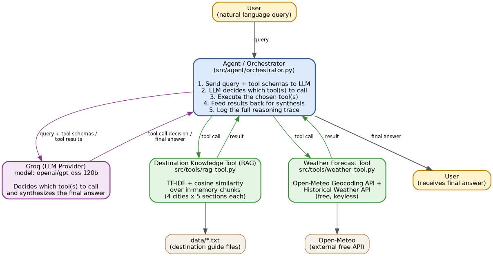

# TripMate — Agentic AI Travel Assistant
🎥 **Loom Video Walkthrough:** https://www.loom.com/share/dac32c18fb474077b8c379904b2eb7e8

TripMate is the agentic core of an AI travel assistant. It answers natural-language
questions about destinations — visa requirements, weather, packing advice, local
customs, and safety — by dynamically deciding which tool(s) to call, rather than
following a fixed script or keyword-based routing.

Built for the AI Agent Developer take-home assessment.

---

## Features

- **Dynamic tool selection**: the LLM decides, per query, whether it needs the
  destination knowledge base, the weather tool, both, or neither.
- **RAG-based destination knowledge tool** over a 4-city data pack (Tokyo,
  Barcelona, Bangkok, Reykjavik), using TF-IDF + cosine similarity.
- **Weather forecast tool** using free, keyless Open-Meteo APIs (geocoding +
  historical averages).
- **Multi-tool reasoning**: packing questions correctly combine destination
  guide tips with actual seasonal weather.
- **Scope awareness**: out-of-scope requests (e.g. "book my flight") are
  clearly declined rather than fabricated.
- **Visible reasoning trace**: every tool call, its arguments, and result are
  logged to both console and `logs/tripmate.log`.

---

## Project Structure

```
tripmate-agent/
├── data/                      # destination guide .txt files (4 cities)
├── logs/                      # runtime logs (gitignored)
├── src/
│   ├── agent/
│   │   └── orchestrator.py    # agent core: LLM tool-calling loop
│   ├── tools/
│   │   ├── rag_tool.py        # search_destination_guide
│   │   └── weather_tool.py    # get_weather_forecast
│   ├── config.py              # env var configuration
│   └── logging_setup.py       # console + file logging setup
├── tests/
│   ├── test_rag_tool.py
│   ├── test_weather_tool.py
│   ├── test_tool_selection.py
│   └── test_integration.py
├── main.py                    # CLI entry point
├── requirements.txt
├── pytest.ini
├── .env.example
└── README.md
```

---

## Setup & Run Instructions

**1. Clone the repository**
```bash
git clone https://github.com/mahima2409/tripmate-agent.git
cd tripmate-agent
```

**2. Create and activate a virtual environment**
```bash
python -m venv venv
# Windows:
venv\Scripts\Activate.ps1
# Mac/Linux:
source venv/bin/activate
```

**3. Install dependencies**
```bash
pip install -r requirements.txt
```

**4. Configure environment variables**
```bash
cp .env.example .env
```
Edit `.env` and add your free Groq API key (get one at https://console.groq.com):
```
GROQ_API_KEY=your_key_here
GROQ_MODEL=openai/gpt-oss-120b
```

**5. Run the agent**
```bash
python main.py
```

**6. Run the tests**
```bash
python -m pytest -v
```

---

## Architecture


```
                    ┌─────────────────────┐
                    │        User          │
                    │  (natural language)  │
                    └──────────┬───────────┘
                               │ query
                               ▼
                 ┌───────────────────────────┐
                 │   Agent / Orchestrator     │
                 │  (src/agent/orchestrator)  │
                 │                            │
                 │  1. Sends query + tool     │
                 │     schemas to LLM         │
                 │  2. LLM decides tool(s)    │
                 │  3. Executes tool call(s)  │
                 │  4. Feeds results back     │
                 │     to LLM for synthesis   │
                 │  5. Logs full trace        │
                 └───────┬───────────┬────────┘
                         │           │
              tool call  │           │  tool call
                         ▼           ▼
        ┌───────────────────────┐ ┌───────────────────────────┐
        │ Destination Knowledge  │ │  Weather Forecast Tool    │
        │ Tool (RAG)             │ │  (src/tools/weather_tool) │
        │ src/tools/rag_tool.py  │ │                            │
        │                        │ │  Open-Meteo Geocoding API │
        │ TF-IDF vectorizer      │ │  + Historical Weather API │
        │ over in-memory chunks  │ │  (free, keyless)           │
        │ (4 cities x 5 sections)│ │                            │
        └───────────┬────────────┘ └────────────┬───────────────┘
                    │                            │
                    ▼                            ▼
         data/*.txt (destination         Open-Meteo (external,
         guide source files)             free API, no key)
                         │           │
                         └─────┬─────┘
                               ▼
                 ┌───────────────────────────┐
                 │      Groq (LLM Provider)   │
                 │  openai/gpt-oss-120b       │
                 │  Handles reasoning +       │
                 │  final answer synthesis    │
                 └──────────┬─────────────────┘
                            │ final answer
                            ▼
                    ┌───────────────┐
                    │     User       │
                    └───────────────┘
```

**Flow**: user query → Orchestrator sends it + tool schemas to Groq → Groq
decides which tool(s) are relevant and returns a tool-call request →
Orchestrator executes the real Python function(s) → results are sent back to
Groq → Groq synthesizes one final natural-language answer → returned to the
user. Every step is logged.

*(A rendered version of this diagram should also be exported as
`architecture.png` for the final submission — see Known Limitations.)*

---

## Tool Schemas (as given to the LLM)

### `search_destination_guide`
```json
{
  "type": "function",
  "function": {
    "name": "search_destination_guide",
    "description": "Search the destination knowledge base for information about visa requirements, best time to visit, local customs, packing tips, or safety notes for a specific city.",
    "parameters": {
      "type": "object",
      "properties": {
        "query": { "type": "string", "description": "A natural-language question or topic, e.g. 'visa requirements for Tokyo'." }
      },
      "required": ["query"]
    }
  }
}
```

### `get_weather_forecast`
```json
{
  "type": "function",
  "function": {
    "name": "get_weather_forecast",
    "description": "Get typical weather conditions (temperature range and conditions) for a city during a given month or date.",
    "parameters": {
      "type": "object",
      "properties": {
        "city": { "type": "string", "description": "The city name, e.g. 'Tokyo'." },
        "date_or_month": { "type": "string", "description": "A month name (e.g. 'December') or a date (e.g. '2025-12-10')." }
      },
      "required": ["city", "date_or_month"]
    }
  }
}
```

---

## Example Runs

### Example 1 — Single-tool (RAG only)

**Input:** `What is the visa requirement for entering Barcelona?`

```
Reasoning: model chose tool=search_destination_guide with args={'query': 'visa requirements for Barcelona'}
Tool call succeeded: result=['Barcelona - VISA & ENTRY: Spain is part of the Schengen Area...', ...]
Final answer: Visitors to Barcelona (Spain) generally do not need a visa for short
tourist stays (up to 90 days within a 180-day period) if they hold a passport
from EU/EEA countries, UK, US, Canada, Australia... Travelers from other
countries may need a Schengen visa.
```

Only the destination knowledge tool was needed — no weather data was relevant
to a visa question.

### Example 2 — Multi-tool (RAG + Weather, chained)

**Input:** `What should I pack for a trip to Reykjavik in February?`

```
Reasoning: model chose tool=search_destination_guide with args={'query': 'packing tips for Reykjavik'}
Tool call succeeded: result=['Reykjavik - PACKING TIPS: Weather can change rapidly...waterproof and windproof outer layers...']

Reasoning: model chose tool=get_weather_forecast with args={'city': 'Reykjavik', 'date_or_month': 'February'}
Tool call succeeded: result={'city': 'Reykjavik', 'month': 2, 'temp_range_c': [-1.4, 3.3], 'conditions': 'frequent rain likely', 'basis': 'averaged from 84 days across the last 3 years'}

Final answer: [Full packing list combining the destination guide's packing
tips (waterproof layers, warm hat/gloves, sturdy footwear) with the actual
forecast (-1.4°C to 3.3°C, frequent rain) -- including swimwear for
geothermal pools, a specific temperature-driven layering plan, and a
climate snapshot.]
```

This demonstrates Module 4 (multi-tool reasoning): the agent recognized a
packing question needs *both* tools, called them in a sensible order, and
synthesized one coherent answer grounded in both sources.

### Example 3 — Out-of-scope (no tool)

**Input:** `Can you book my flight to Bangkok?`

```
Final answer (no tools called): I'm sorry, but I can't help with booking
flights. I'm here to provide information about destinations -- like visa
requirements, weather, packing tips, safety, and local customs -- if that
would be useful for your trip planning.
```

The agent correctly recognized this request was outside its capabilities and
declined clearly, without fabricating a booking confirmation or calling any
tool.

### Example 4 — Error handling (unknown city)

**Input (direct tool test):** `get_weather_forecast("Notarealcityxyz123", "December")`

```
Result: {'error': "Could not find a location matching 'Notarealcityxyz123'. Please check the spelling or try a nearby major city."}
```

Instead of crashing or fabricating weather data, the tool returns a clear
error the agent can relay honestly to the user.

### Example 5 — Error handling (unsupported destination)

**Input:** `What is the visa requirement for Paris?`

```
Reasoning: model chose tool=search_destination_guide with args={'query': 'visa requirements for Paris'}
WARNING: No supported destination named in query. Supported cities: ['Bangkok', 'Barcelona', 'Reykjavik', 'Tokyo']
Tool call succeeded: result=[]

Final answer: I'm sorry -- I don't have destination-guide data for Paris.
I can provide visa information for Tokyo, Barcelona, Bangkok, or Reykjavik.
Let me know if you'd like details for any of those cities!
```

This demonstrates the "unknown/unsupported destination" error case. Early
testing showed that TF-IDF similarity alone isn't reliable here: a query like
"visa requirements for Paris" scored almost identically to a real
"visa requirements for Barcelona" query, since the match comes from the
surrounding words ("visa requirements for"), not the city name itself. To
fix this, `search_destination_guide` explicitly checks whether the query
names one of the 4 supported cities before searching, and returns an empty
list if not -- rather than letting the LLM fill the gap with its own general
knowledge. The system prompt also explicitly instructs the agent that an
empty RAG result means the destination is unsupported, not a signal to
answer from its own training data.

---

## Design Decisions & Assumptions

- **LLM provider — Groq (`openai/gpt-oss-120b`)**: chosen for free-tier
  access, very low latency (useful for a responsive CLI demo), and native
  OpenAI-compatible function-calling, which lets the orchestration logic stay
  simple and explicit.
- **Raw function-calling loop instead of a framework** (LangChain/LangGraph):
  for a project this size, a framework adds abstraction without adding much
  value, and a raw loop is easier to reason about, log, and explain in the
  video walkthrough.
- **RAG: TF-IDF + cosine similarity instead of dense embeddings**: with only
  4 cities / 20 chunks, a lightweight, dependency-free, fully local approach
  is more than sufficient and avoids any model download or API cost. See
  Scalability section for how this would change at larger scale.
- **Chunking strategy — one chunk per section per city**: since each
  destination file has 5 consistently labeled sections (Visa, Best Time,
  Customs, Packing, Safety), chunking along those boundaries keeps each
  retrieved chunk semantically complete, rather than splitting mid-thought
  with fixed-size chunking.
- **Weather tool — Open-Meteo historical averages, not a live forecast**:
  Open-Meteo's live forecast only covers ~16 days ahead, but trip planning
  usually happens weeks or months out. Averaging the last 3 years of
  historical data for the requested month gives a realistic "typical
  conditions" answer, which is what a traveler actually needs when packing
  for a future month.
- **Unit/tool-selection tests mock the LLM; only the integration test makes a
  real Groq call**: this keeps the majority of the test suite fast, free,
  deterministic, and independent of network/API availability, while the one
  integration test still proves the full real-world flow works end-to-end
  (as explicitly requested).
- **Errors are returned as structured `{"error": ...}` dicts from tools**
  (rather than raising uncaught exceptions to the LLM) so the agent can relay
  a clear, honest message to the user instead of crashing mid-conversation.

---

## Known Limitations

- The knowledge base only covers 4 cities; any other destination will return
  no relevant chunks, and the agent will say so rather than fabricate
  information.
- Weather data is a historical average, not a live forecast — it won't
  reflect unusual/anomalous conditions for a specific future date.
- The agent currently only supports single-turn queries in `main.py` (no
  persistent multi-turn conversation memory across separate `python main.py`
  runs).
- No caching layer yet, so repeated identical queries re-run both the LLM
  call and any tool calls (see Scalability below).
- `architecture.png` should be generated from the diagram above (e.g. via
  draw.io, Excalidraw, or Mermaid export) for the final submission.

## Suggested Future Improvements

- Add conversation memory so follow-up questions ("what about in summer
  instead?") don't require repeating the full context.
- Add a real-time weather fallback for near-term trips (<16 days out) using
  Open-Meteo's live forecast endpoint alongside the historical-average path.
- Add semantic (embedding-based) retrieval as the knowledge base grows past a
  size where TF-IDF's lexical matching starts missing paraphrased queries.
- Add a simple caching layer (see Scalability) to cut redundant LLM/API
  costs.
- Expose the agent via a small API/web UI instead of only a CLI.

---

## Scalability Considerations (Discussion Only)

**RAG scaling from 4 cities to several hundred:**
TF-IDF works well at this tiny scale but its lexical (keyword-overlap)
matching will start missing paraphrased or multilingual queries as the
corpus grows. At hundreds of cities, I'd move to dense embeddings (e.g. a
free local `sentence-transformers` model or an embedding API) stored in a
proper vector database (FAISS or ChromaDB) rather than an in-memory matrix,
so indexing and search stay fast and don't need to be rebuilt from scratch
on every process start. I'd also add metadata filtering (e.g. filter by
city first, then search within that city's chunks) to keep retrieval precise
as content volume grows.

**Avoiding redundant tool/LLM calls for repeated or similar queries:**
I'd add a cache keyed on a normalized version of the query (and, for
`get_weather_forecast`, on `city + month`, since that result doesn't change
minute-to-minute). A simple in-memory LRU cache or Redis for
multi-instance deployments would avoid re-calling the weather API or
re-running the LLM for queries the system has already effectively answered.
Semantic caching (checking if a new query is close enough in embedding space
to a previously cached one) would catch paraphrased repeats too.

**Reducing LLM API costs at higher query volume:**
- Cache aggressively (see above) -- many trip-planning questions repeat
  across users (e.g. "packing for Tokyo in April").
- Use a smaller/faster model for simple, clearly single-tool queries, and
  only route to a larger model when the query is ambiguous or needs deeper
  reasoning.
- Batch or pre-compute answers for very common query patterns per city/month.

**Keeping tool-selection latency low as tools grow:**
- Group tools into categories and only expose the relevant subset of tool
  schemas to the LLM per query (a lightweight pre-router), rather than
  always sending every tool's schema in every request -- this keeps the
  prompt smaller and the decision faster as the tool count grows.
- Keep tool descriptions concise and non-overlapping so the model doesn't
  have to disambiguate between similar-sounding tools.

---

## Testing

```bash
python -m pytest -v
```

- `tests/test_rag_tool.py` — unit tests for the RAG tool (real data, no LLM).
- `tests/test_weather_tool.py` — unit tests for the weather tool (real
  Open-Meteo calls + input validation, no LLM).
- `tests/test_tool_selection.py` — validates correct routing for
  single-tool, multi-tool, and no-tool queries, with the LLM mocked for
  speed and determinism.
- `tests/test_integration.py` — one true end-to-end test with a real Groq
  call, proving the full multi-tool flow works live.
